# 👩‍💻 금융상품 비교 애플리케이션

---

## ✅ 개요 

- 주제 : 예적금 상품 비교 및 추천 웹 사이트
- 서비스명 : redeFINe
    - 금융을 재정의한다는 의미로 회원 맞춤형 정보 제공, 분석, 상품 추천 기능을 의미합니다.
- 프로젝트 기간 : 2024.05.16 ~ 2024.05.23

## ✅ 개발 일지 

- 팀원 정보 및 업무 분담 내역

| 날짜 | 수인 | 아영 |
| --- | --- | --- |
| 2024 / 05 / 16 | 모델 구성, ERD 작성, vue 컴포넌트 생성 | 컴포넌트 구성, 모델 구성, 게시판 crud 구현 |
| 2024 / 05 / 17 | 환율 api 데이터 조회/ db저장 | articles model, serializer 설계 |
| 2024 / 05 / 18 | 지도 완성 | article crud 구현 |
| 2024 / 05 / 19 | 댓글 crud, article 수정 기능 | profile페이지 구현, Authentication 기능 구현 |
| 2024 / 05 / 20 | 게시글 좋아요 기능, 프로필 페이지에 좋아요한 목록 출력, dummy data 생성, 환율계산기 완성 | 예적금 정보 api 데이터 조회, 예적금 리스트 출력, 예적금 상세페이지 구현 |
| 2024 / 05 / 21 | 예적금 상품 필터링, AI Chatbot 구현 | 예적금 상품의 관심 상품 등록/취소, 추천 알고리즘 구현, 프로필 정보 출력 |
| 2024 / 05 / 22 | 로고 생성 , css - 내브바 / 예적금상품 리스트 / 예적금 상품 필터 | css - 프로필 정보 / 관심있는 게시물과 상품 정보 / 게시판 |
| 2024 / 05 / 23 |  css - 예적금 상품 디테일 / chat-bot 페이지 / 메인페이지  | css - 은행 지도 / 환율 페이지 / 추천상품 페이지 |

## ✅ 개발 환경
- Python
- Django
- Node.js
- Vue 3 & Pinia

## ✅ 프로젝트 소개
- 저희는 재정의하다는 뜻의 redefine에서 finance의 약자인 FIN을 강조하여 복잡한 금융 서비스를 한눈에 볼 수 있도록 **금융을 재정의하다** 는 뜻의 웹 애플리케이션을 기획하였습니다.
- 금융 정보를 하나하나 찾아볼 수 없는 바쁜 현대인에게 간단한 회원정보만 입력하면 예금 / 적금 금리 비교, 환율 계산, 은행 검색 뿐만 아니라 나에게 맞는 상품 추천을 추천해주는 서비스를 제공합니다.

## ✅ 데이터베이스 모델링 (ERD)
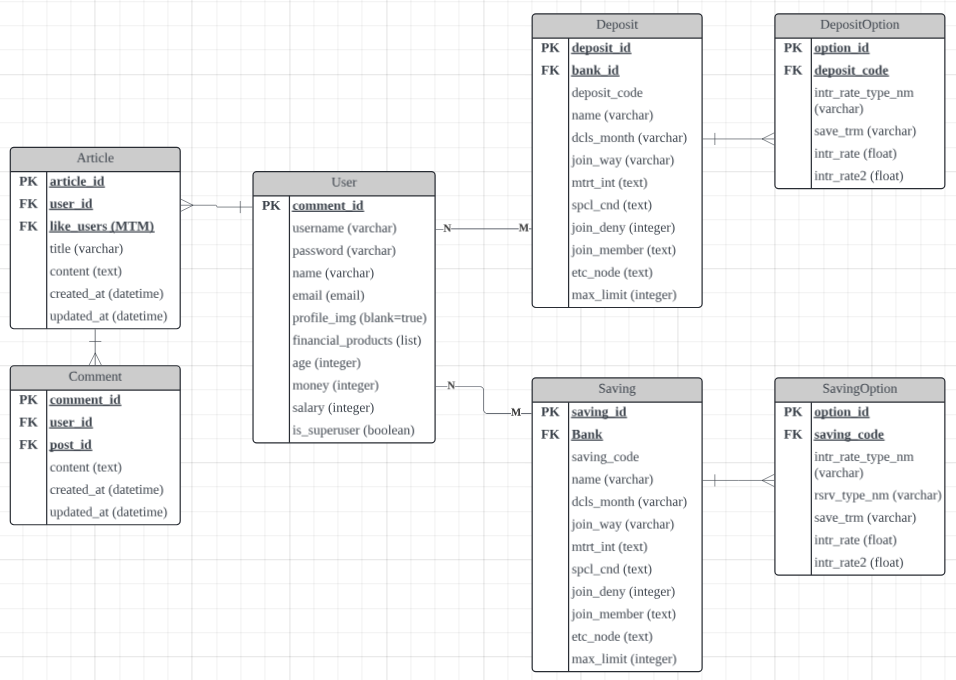
1. User
    - 회원가입 필드 : username(ID), password, name(이름), email
    - 상품 추천과 서비스 이용을 위한 필드 : financial_products(관심상품-상품코드/옵션id), age(나이), money(자산), salary(연봉)
        - 제공된 금융 상품을 관심상품으로 등록하면 financial 필드에 저장됩니다.
        - age, money, salary 정보를 바탕으로 유저에게 알맞는 금융 상품을 추천해줍니다.
2. Article / Comment
    - 게시물과 작성자를 M : N으로 연결하여 좋아요 기능을 제공합니다.
    - 게시물과 댓글을 M : 1로 연결하여 게시글에 댓글 기능을 제공합니다.
3. Deposit / Saving
    - 정기예금 상품 또는 적금 상품과 그 상품의 옵션을 M : 1로 연결하여 상품별 옵션을 조회합니다.

## ✅ 설계 내용 및 실제 구현 정도

### 0️⃣ 홈화면
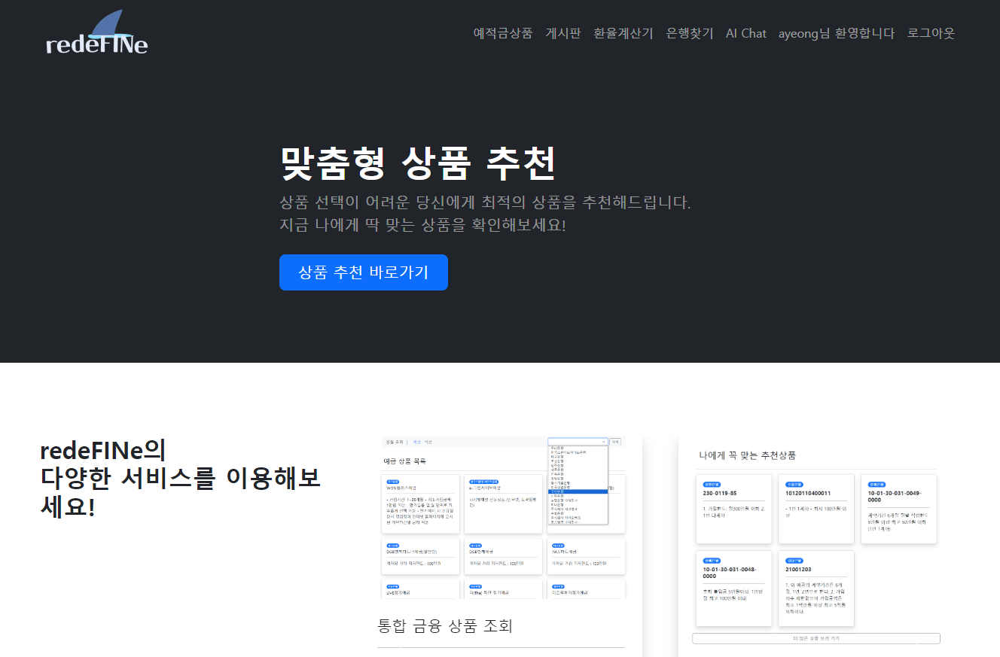
- nav / main / footer로 구성
- 내브바에 주요 기능으로 가는 링크 출력
- 로그인 여부에 따라 다른 화면 출력

### 1️⃣ Authenticated
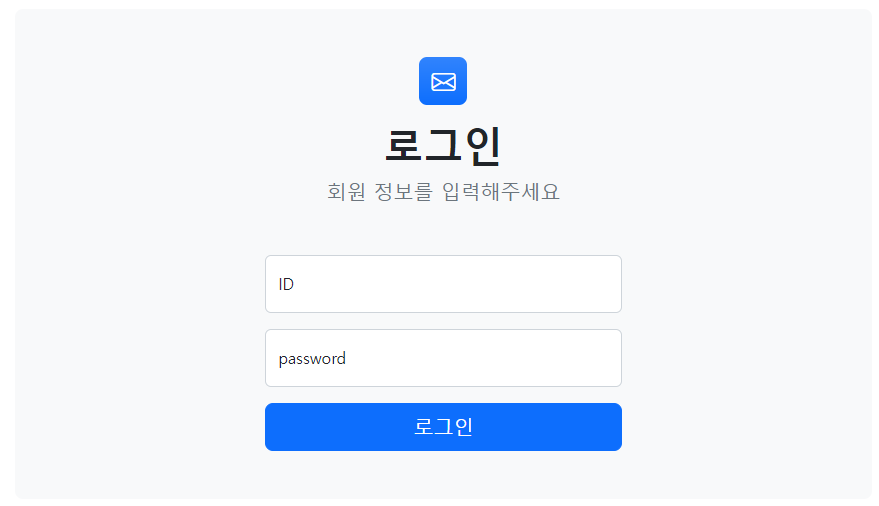
- 회원가입 / 회원탈퇴 / 로그인 / 로그아웃 기능
- 로그인 유무에 따라 페이지 출력, 사용기능 차별화

### 2️⃣ 게시글 CRUD
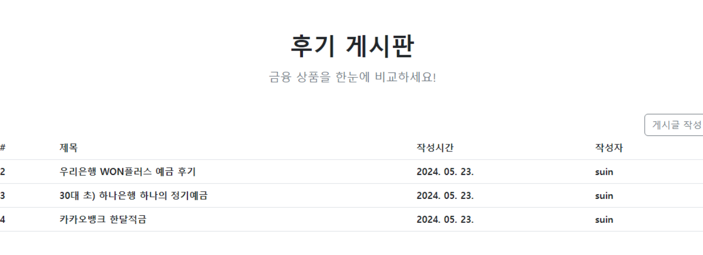
- 게시글 작성 / 조회 / 수정 / 삭제 기능
- 본인 게시글만 수정 / 삭제 가능 하도록 구현
- 본인 게시물이 아닌 게시물에 좋아요 버튼 출력
    - 게시물과 회원정보를 M : N으로 저장

### 3️⃣ 댓글 CRUD
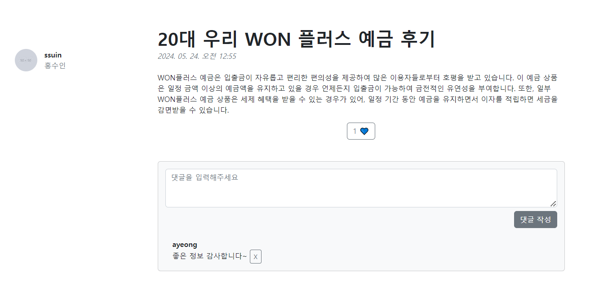
- 댓글 작성 / 조회 / 삭제 기능 구현
- 본인 댓글만 삭제 가능 하도록 구현

### 4️⃣ 프로필 페이지
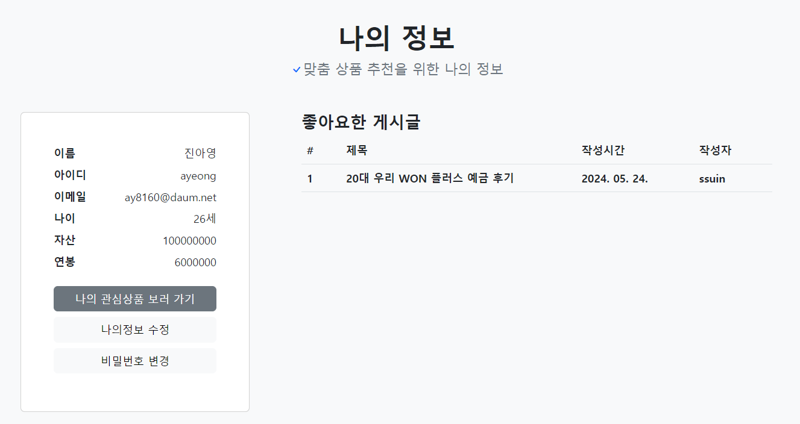
- 나의 회원 정보와 좋아요한 게시글 조회, 회원 정보 수정 / 비밀번호 변경 / 탈퇴 기능
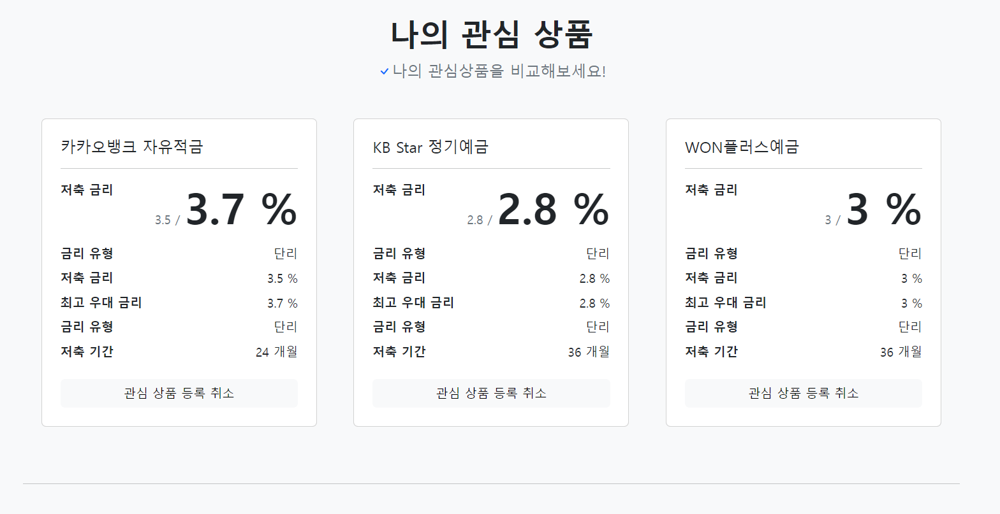
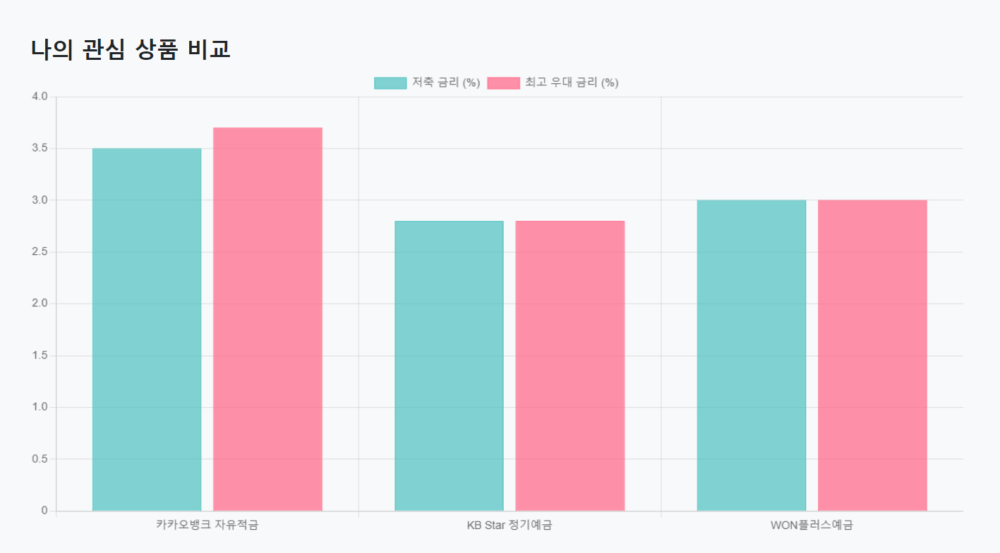
- 내가 좋아요한 상품 정보와 그 상품의 그래프를 출력하여 금리 비교

### 5️⃣ 금융상품 정보 저장 / 조회
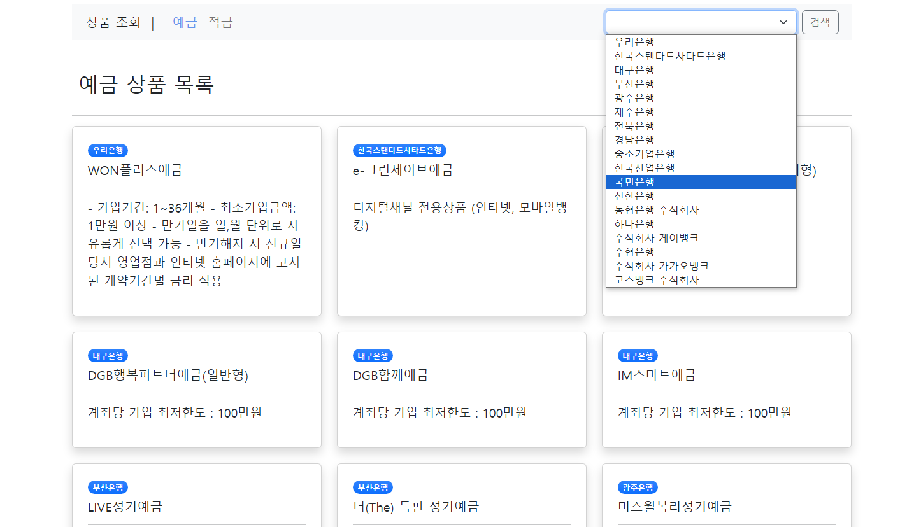
- 오픈 API를 이용해 금융 정보 DB에 저장
    - 금융 상품 코드와 상품별 옵션 정보를 N : 1로 저장
- 저장된 금융 상품 조회 기능
    - 필터 추가하여 은행별로 조회 가능
    - 상품별 옵션 정보 조회
- 금융상품 관심 상품으로 등록
    - user 프로필에 금융 상품 코드와 옵션 번호를 문자열로 저장 / 취소 기능 구현

### 6️⃣ 금융상품 추천 알고리즘
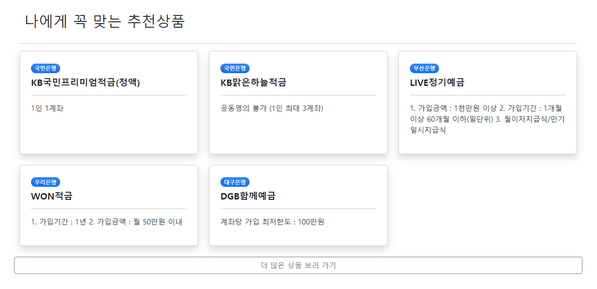
- 회원가입시 저장된 회원 정보 ( 나이, 연봉, 자산 ) 로 자신과 비슷한 회원이 많이 가입한 (상위 5개) 금융 상품 추천

### 7️⃣ 지도 검색
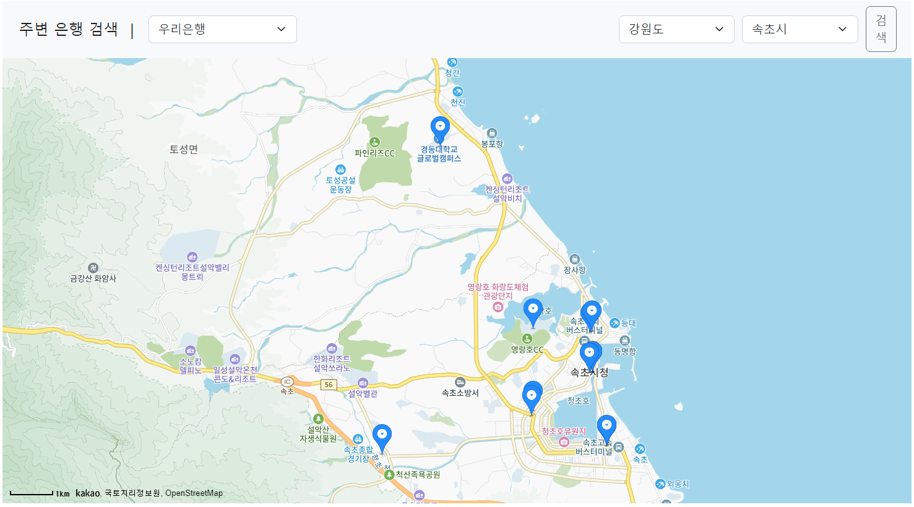
- API를 이용해 카카오맵 불러오기
- 원하는 위치를 입력하면 은행 정보 출력

### 8️⃣ 환율 계산기
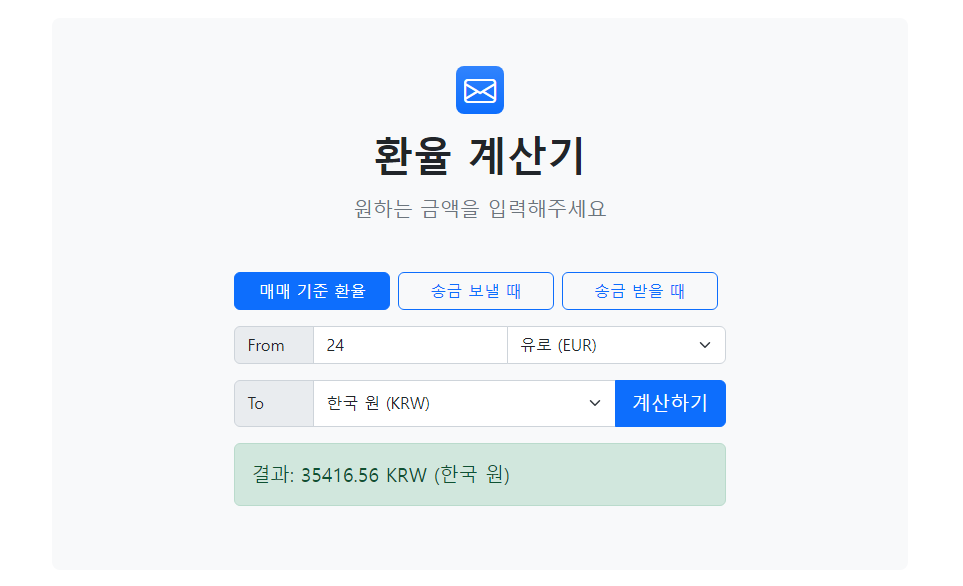
- 페이지를 로드할때마다 API를 이용해 새로운 환율 정보를 불러오기
- 원하는 환전 금액을 입력하면 환율 정보 제공

### 9️⃣ AI 챗봇
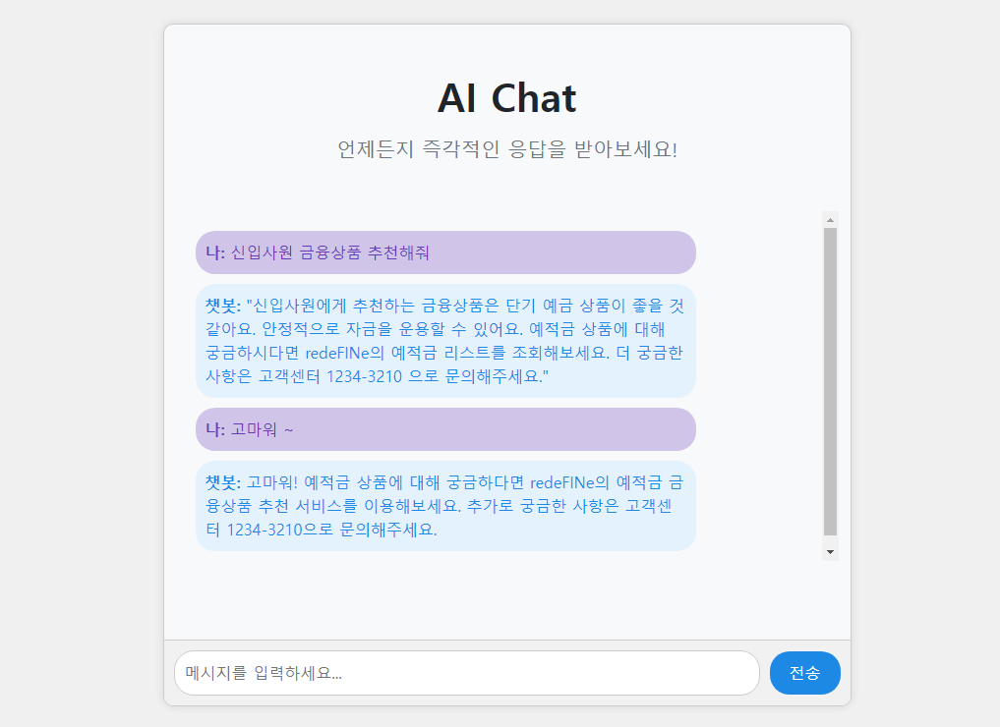
- AI를 활용하여 금융서비스 및 데이터 검색

## 💭 느낀 점, 후기

- 진아영
    - 싸피에서 약 5개월간 학습한 python, django, vue, javascript를 사용하여 금융상품 추천 페이지를 만들었습니다. 제출 마감일이 다가오니 인증 과정에서 사용자의 실수로 발생한 에러 상황을 알려주지 못하는 등 완벽히 구현하지 못한 부분이 많았습니다. 
    특히 유저 모델 설계할 때 유저의 관심상품 필드를 텍스트필드로 설계한것이 제일 아쉬웠습니다. 이로 인해 관심상품의 그래프를 출력하기 위해서는 옵션 정보를 함께 텍스트로 붙여서 저장해야했고, 유저 더미데이터 생성을 완벽하게 하지 못하였기 때문에 상품 추천 과정에서 특정 상품의 옵션을 추천하지 못했습니다. 
    또한 프로젝트 시작할때 완벽하게 설계했다고 생각했지만 놓친 부분이 있어서 불필요한 component 생성이 많았습니다. 이런 문제는 routerlink와 routerview 사용시에 새로 불러오지 않아도 될 정보를 전부 새로 불러와야하는 문제로 이어졌습니다. 
    하지만 프로젝트를 하면서 싸피 실습 시간에 이해하지 못한 부분을 알 수 있었습니다. 다음번 프로젝트에서는 이번 프로젝트를 하면서 느꼈던 아쉬운 부분을 보완하여 더 완성도 높은 프로그램을 구현하고 싶습니다.
- 홍수인
    - 1학기 ssafy의 커리큘럼의 전반적인 내용을 바탕으로 프로젝트를 처음부터 해볼 수 있어서 배운 내용을 되세기고 적용하기에 좋은 경험이었다. 
    우선 프로젝트 기획 단계에서 모델 설계, 컴포넌트 설계, url 구조 설계 등의 과정을 거치면서 기획 단계가 중요하다는 것을 느끼게 되었다. 
    오픈 api를 이용한 기능 구현이 많아서 데이터를 가공하고 사용하는 법을 확실히 배울 수 있었던 시간이었다. 
    구현하는 과정에서 처음 시작은 막막했으나 구조부터 잡아가며 팀원과 함꼐 하니까 해결할 수 있었던 것 같다. 
문제점을 해결하여 정상적인 기능을 구현했을 때 개발에 대한 흥미도 동시에 느낄 수 있었던 시간이었다. 
하지만 부족함을 많이 느꼈던 시간이었기에 다음 학기까지 남은 시간을 부족함을 채우기 위해 노력해야겠다는 생각이 들었다. 